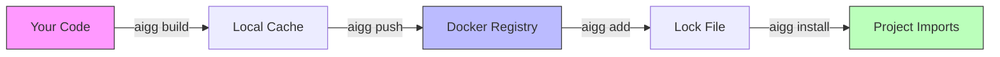

# aigogo

**Share reusable AI agents between projects in seconds.**

aigogo is an agent manager that lets you build, share, and install AI agents. No publishing pipelines, no package ecosystem overhead — just your agents, versioned and importable.

## Why aigogo?

You have a useful agent, or even a component of one (such as a prompt template, a tool-calling decorator or an API client wrapper). You want to reuse it across three projects. Your options:

- **Copy-paste** it into each project (now you have three copies to maintain)
- **Publish to PyPI** (heavyweight for a single file)
- **Git submodules** (fragile, confusing)

aigogo gives you a fourth option: **package it once, share it everywhere**.

## Quick Start

### 0. Install (macOS/Linux)

```bash
brew tap aupeachmo/aigogo
brew install aigg
```

**Enable tab completion** (optional):

```bash
source <(aigg completion bash)   # Bash — or add to ~/.bashrc
source <(aigg completion zsh)    # Zsh  — or add to ~/.zshrc
aigg completion fish > ~/.config/fish/completions/aigg.fish  # Fish
```

### 1. Package your code

```python
# tool_decorator.py — a reusable utility you want to share
import json, inspect

def tool(func):
    """Decorator that generates an OpenAI-compatible tool schema from type hints."""
    hints = func.__annotations__
    schema = {
        "type": "function",
        "function": {
            "name": func.__name__,
            "parameters": {
                "type": "object",
                "properties": {k: {"type": "string"} for k in hints if k != "return"}
            }
        }
    }
    func.schema = schema
    return func
```

```bash
cd my-tool-decorator
aigg init                              # creates aigogo.json manifest
aigg add file tool_decorator.py        # track the file
aigg build                             # package it locally
```

### 2. Share it

```bash
aigg login docker.io                   # or ghcr.io, any Docker V2 registry
aigg push docker.io/you/tool-decorator:1.0.0 --from tool-decorator:1.0.0
```

### 3. Use it in another project

```bash
cd ~/my-agent-project
aigg add docker.io/you/tool-decorator:1.0.0
aigg install
```

```python
from aigogo.tool_decorator import tool

@tool
def get_weather(city: str) -> str:
    """Get current weather for a city."""
    return f"Sunny in {city}"

print(get_weather.schema)
# {"type": "function", "function": {"name": "get_weather", ...}}
```

That's it. No `pip install`, no `setup.py`, no `pyproject.toml` publishing — just your code, versioned and importable.

## How It Works



| Step | Command | What happens |
|------|---------|-------------|
| **Build** | `aigg build` | Packages files into local cache (`~/.aigogo/cache/`) |
| **Push** | `aigg push registry/name:tag --from name:tag` | Uploads to any Docker V2 registry |
| **Add** | `aigg add registry/name:tag` | Pulls package, stores in content-addressable store, writes `aigogo.lock` |
| **Install** | `aigg install` | Creates import symlinks so `from aigogo.pkg` just works |

Packages are stored by SHA256 hash for integrity. Lock files pin exact versions for reproducible installs.

## Installation

### Homebrew (macOS/Linux)

```bash
brew tap aupeachmo/aigogo
brew install aigg
```

### Binary Release

```bash
# macOS (Apple Silicon)
curl -sL https://github.com/aupeachmo/aigogo/releases/latest/download/aigg-darwin-arm64.tar.gz | tar xz
sudo mv aigg-darwin-arm64 /usr/local/bin/aigg

# macOS (Intel)
curl -sL https://github.com/aupeachmo/aigogo/releases/latest/download/aigg-darwin-amd64.tar.gz | tar xz
sudo mv aigg-darwin-amd64 /usr/local/bin/aigg

# Linux (AMD64)
curl -sL https://github.com/aupeachmo/aigogo/releases/latest/download/aigg-linux-amd64.tar.gz | tar xz
sudo mv aigg-linux-amd64 /usr/local/bin/aigg

# Linux (ARM64)
curl -sL https://github.com/aupeachmo/aigogo/releases/latest/download/aigg-linux-arm64.tar.gz | tar xz
sudo mv aigg-linux-arm64 /usr/local/bin/aigg
```

### From Source

```bash
git clone https://github.com/aupeachmo/aigogo.git
cd aigogo
make build && sudo make install
```

## Usage

### Creating a Package

```bash
aigg init                           # create aigogo.json
aigg add file "*.py"                # track source files
aigg add dep requests ">=2.31.0"    # declare dependencies
aigg validate                       # verify deps match imports
aigg build                          # package locally (auto-increments version)
```

### Sharing a Package

```bash
aigg login docker.io                # authenticate (Docker Hub, ghcr.io, etc.)
aigg push docker.io/org/pkg:1.0.0 --from pkg:1.0.0
```

### Using a Package

```bash
aigg add docker.io/org/pkg:1.0.0   # pull and pin in aigogo.lock
aigg install                        # create import symlinks
```

```python
# Python — works immediately, no PYTHONPATH needed
from aigogo.pkg import my_function
```

```javascript
// JavaScript — require the register script once
require('./.aigogo/register');
const pkg = require('@aigogo/pkg');
```

### Team Workflow

```bash
# Commit the lock file, gitignore the imports
git add aigogo.lock
echo ".aigogo/" >> .gitignore

# Teammates just run:
git pull && aigg install
```

### Local-Only (No Registry)

You don't need a registry at all. Build locally and reference by name:

```bash
# Project A: build a package
aigg init && aigg add file utils.py && aigg build my-utils:1.0.0

# Project B: use it
aigg add my-utils:1.0.0 && aigg install
```

## Examples

The [`examples/`](examples/) directory includes ready-to-use AI/LLM packages:

| Package | Description |
|---------|-------------|
| [prompt-templates](examples/prompt-templates) | Structured prompt templates with variable substitution and chaining |
| [tool-use-decorator](examples/tool-use-decorator) | Convert Python functions into OpenAI-compatible tool-calling schemas |
| [llm-response-parser](examples/llm-response-parser) | Extract structured data (JSON, lists, key-value pairs) from LLM responses |
| [embedding-search](examples/embedding-search) | Cosine similarity search and deduplication for embedding vectors |
| [agent-context-manager](examples/agent-context-manager) | Sliding-window context management for multi-turn LLM conversations |
| [token-budget-js](examples/token-budget-js) | Token counting and budget management for LLM API calls (JavaScript) |

Each includes an `aigogo.json` with an `ai` field for agent discovery. See [MACHINES.md](MACHINES.md) for the AI metadata spec.

## Command Reference

```bash
# Package authoring
aigg init                        # create aigogo.json
aigg add file <path>             # add files to manifest
aigg add dep <pkg> <version>     # add runtime dependency
aigg add dev <pkg> <version>     # add dev dependency
aigg rm file|dep|dev <name>      # remove from manifest
aigg scan                        # auto-detect imports
aigg validate                    # check declared vs actual deps
aigg build [name:tag]            # build locally

# Package consumption
aigg add <registry/name:tag>     # pull and add to lock file
aigg add <name:tag>              # add from local cache
aigg install                     # create import symlinks from lock file
aigg uninstall                   # remove imports and path config

# Registry
aigg login <registry>            # authenticate
aigg logout <registry>           # remove credentials
aigg push <ref> --from <local>   # upload to registry
aigg pull <ref>                  # download without installing
aigg delete <ref>                # delete from registry

# Utilities
aigg list                        # show cached packages
aigg remove <name:tag>           # delete from local cache
aigg remove-all                  # clear entire cache
aigg show-deps <path> [--format] # show deps (text/pyproject/poetry/requirements/npm/yarn)
aigg version                     # show version info
aigg completion <shell>          # generate shell completions (bash/zsh/fish)
```

## Project Layout

After `aigg install`, your project looks like:

```
my-project/
├── aigogo.lock          # pin exact versions — commit this
├── .aigogo/             # import symlinks — gitignored
│   ├── imports/
│   │   ├── aigogo/      # Python: from aigogo.<pkg> import ...
│   │   └── @aigogo/     # JS: require('@aigogo/<pkg>')
│   └── register.js      # Node.js path registration
└── your_code.py
```

## Supported Languages

| Language | Import Style | Path Config |
|----------|-------------|-------------|
| Python | `from aigogo.pkg import fn` | Auto `.pth` file in site-packages |
| JavaScript | `require('@aigogo/pkg')` | Auto `register.js` for NODE_PATH |

Go and Rust are supported for package authoring (file discovery, dependency generation) but don't have namespace import setup.

## FAQ

**Do I need Docker installed?**
No. aigg talks directly to registry APIs. No Docker daemon required.

**What registries work?**
Any Docker V2 registry: Docker Hub, GitHub Container Registry (ghcr.io), GitLab, AWS ECR, etc.

**How is this different from pip/npm?**
aigogo manages *AI agents as source code*, not compiled packages. Your agent code is copied into the project and imported directly — no build step, no virtualenv conflicts, no dependency resolution. Think of it as "git submodules done right."

**What about dependencies?**
Dependencies are declared in `aigogo.json` as metadata. Use `aigg show-deps --format requirements` to pipe them into pip, or `--format npm` for package.json. aigogo manages the agents; your existing package manager handles the dependencies.

## Development

```bash
git clone https://github.com/aupeachmo/aigogo.git && cd aigogo
make build          # build binary
make test           # run unit tests
make qa             # run integration tests (68 tests)
make lint           # run golangci-lint
```

## License

MPL-2.0 — See [LICENSE](LICENSE) for details.

## Links

- [Documentation](docs/)
- [Examples](examples/)
- [AI Agent Integration](MACHINES.md)
- [Language Support](LANGUAGES.md)
- [Releases](https://github.com/aupeachmo/aigogo/releases)
- [Issues](https://github.com/aupeachmo/aigogo/issues)
